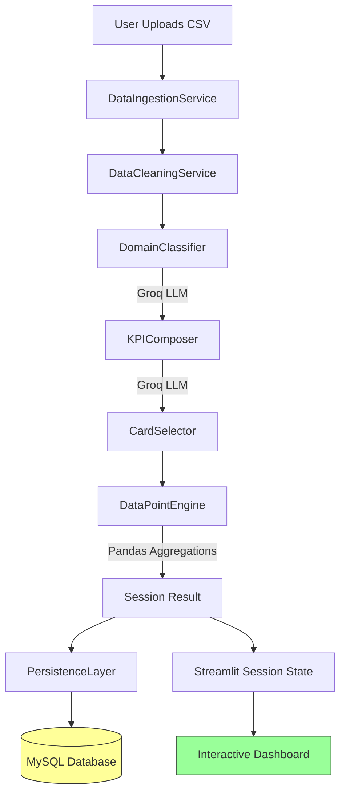

# KPI Agent Blueprint

This repository contains a blueprint for building an automated **KPI Agent**. This agent is designed to ingest raw data (CSV), classify its domain, generate relevant KPIs, and produce descriptive analytics using LLMs and PandasAI.

## 🚀 Objective

To build an intelligent system that automates the "Data Analyst" workflow:
1.  **Ingest & Clean**: Handle raw CSVs with automated cleaning.
2.  **Classify**: Determine the business domain (e.g., E-commerce, Finance).
3.  **Generate KPIs**: Create industry-standard metrics.
4.  **Visualize**: Select top cards and generate data points for charts.
5.  **Analyze**: Provide text-based insights for each KPI.
6.  **Persist**: Store analysis results in MySQL for audit and retrieval.

## 🛠 Tech Stack

-   **Language**: Python 3.10+
-   **LLM Provider**: [Groq](https://groq.com/) (Llama 3.3-70b-versatile)
-   **Data Processing**: Pandas
-   **Database**: MySQL
-   **Frontend**: Streamlit with in-memory session state
-   **Testing**: Pytest

## 📂 Repository Structure

```text
KPI-Agent-Blueprint/
├── README.md               # You are here
├── requirements.txt        # Python dependencies
├── .env.example            # Environment variables template
├── src/
│   ├── main.py             # Orchestrator Entry Point
│   ├── config.py           # Configuration loader
│   ├── models/             # Pydantic Data Models
│   │   └── domain.py       # KPI, Card, DataPoint definitions
│   ├── services/           # Core Business Logic
│   │   ├── ingestion.py    # Data Loading & Cleaning
│   │   ├── classifier.py   # Domain Classification (LLM)
│   │   ├── composer.py     # KPI Generation (LLM)
│   │   ├── card_selector.py# Top KPI Selection (LLM)
│   │   ├── data_engine.py  # Data extraction (Pandas)
│   │   ├── analytics.py    # Descriptive Text (LLM)
│   │   └── persistence.py  # MySQL Storage
│   ├── llm/                # LLM Integration
│   │   ├── client.py       # Wrapper for Groq
│   │   └── prompts.py      # System Prompts
│   └── ui/                 # Frontend
│       └── app.py          # Streamlit Dashboard
├── tests/                  # Unit & Integration Tests
└── scripts/
    └── run_sample.py       # Example run script
```

## ⚡ Quick Start

### 1. Prerequisites
-   Python 3.10+ installed.
-   MySQL instance running.
-   Groq API Key.

### 2. Setup

```bash
# Clone the repository
git clone <repository_url>
cd KPI-Agent-Blueprint

# Create virtual environment
python -m venv venv
source venv/bin/activate  # On Windows: venv\Scripts\activate

# Install dependencies
pip install -r requirements.txt

# Configure Environment
cp .env.example .env
# Edit .env and add your API Keys
```

### 3. Run the App

**Backend Pipeline (Test CLI):**
```bash
python scripts/run_sample.py
```

**Frontend Dashboard:**
```bash
streamlit run src/ui/app.py
```

## 🧪 Testing

```bash
pytest tests/
```

## 🏗 Architecture & Flow

### Pipeline Overview

1.  **Ingestion**: `DataIngestionService` loads CSV from file upload or URL, normalizes column names to snake_case
2.  **Cleaning**: `DataCleaningService` handles missing values, duplicates, and outliers with configurable imputation strategies
3.  **Domain Classification**: `DomainClassifier` sends a data sample to Groq LLM (Llama 3.3-70b-versatile) to detect business context
4.  **KPI Generation**: `KPIComposer` generates potential metrics based on detected domain and available columns
5.  **Card Selection**: `CardSelector` uses LLM to select the top relevant KPIs
6.  **Data Extraction**: `DataPointEngine` calculates actual values/trends for the selected KPIs using Pandas aggregations
7.  **Analysis**: `DescriptiveAnalytics` generates business insights (currently disabled for performance optimization)
8.  **Persistence**: `PersistenceLayer` saves the complete analysis result as JSON to MySQL database
9.  **UI**: Streamlit dashboard operates in-memory using session state

### Flow Diagram



### Streamlit UI Architecture

The UI provides 6 interactive pages, all operating on **in-memory data**:

1. **Upload**: File upload with initial data preview
2. **Preview**: Detailed dataset statistics and sample view  
3. **Cleaning**: Configure imputation strategies and apply data cleaning
4. **Dashboard**: Auto-generated KPI visualizations (bar/line/pie/scatter charts)
5. **Insights**: AI-generated business insights and recommendations
6. **Chat with Data**: Interactive Q&A interface for data exploration

**Note**: All data transformations and analysis results are stored in session state. Database persistence is a background operation for audit/recovery purposes.
